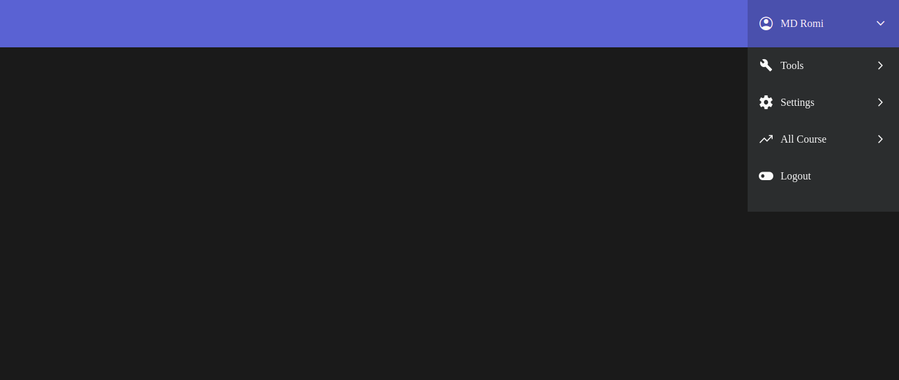

### Dropdown

  

### HTML
```HTML
<!DOCTYPE html>
<html lang="en">
<head>
    <meta charset="UTF-8">
    <meta http-equiv="X-UA-Compatible" content="IE=edge">
    <meta name="viewport" content="width=device-width, initial-scale=1.0">
    <link
      rel="stylesheet"
      href="https://fonts.googleapis.com/css2?family=Material+Symbols+Outlined:opsz,wght,FILL,GRAD@48,400,1,0"
    />
    <link rel="stylesheet" href="./style.css">
    <title>Dropdown</title>
</head>
<body>
    <nav>
        <div class="dropdown" id="dropdown">
            <button onclick="handleDropdownClicked(event)">
                <span class="material-symbols-outlined"> account_circle </span>
                MD Romi
                <span class="chevron material-symbols-outlined"> expand_more </span>
            </button>
            <div class="menu" id="menu">
                <div class="menu-inner" id="menu-inner">
                    <div class="main-menu">
                        <button onclick="handleSubMenuClicked('my-tools')">
                            <span class="material-symbols-outlined"> build </span>Tools
                            <span class="chevron material-symbols-outlined">
                            chevron_right
                            </span>
                        </button>
                        <button onclick="handleSubMenuClicked('settings')">
                            <span class="material-symbols-outlined"> settings </span>
                            Settings
                            <span class="chevron material-symbols-outlined">
                              chevron_right
                            </span>
                        </button>
                        <button onclick="handleSubMenuClicked('all-course')">
                            <span class="material-symbols-outlined"> trending_up </span>
                            All Course
                            <span class="chevron material-symbols-outlined">
                              chevron_right
                            </span>
                        </button>
                        <button>
                            <span class="material-symbols-outlined"> toggle_off </span>
                            Logout
                        </button>
                        <!-- other menu buttons -->
                    </div>
                    <div id="my-tools" class="sub-menu">
                        <button onclick="handleSubMenuClicked()">
                            <span class="material-symbols-outlined"> arrow_back </span>
                            Tools
                        </button>
                        <button>
                            <span class="material-symbols-outlined"> description </span>
                            Files
                        </button>
                        <button>
                            <span class="material-symbols-outlined"> cloud_upload </span>
                            Uploads
                        </button>
                        <button>
                            <span class="material-symbols-outlined"> movie </span>
                            Movies
                        </button>
                        <!-- other menu buttons -->
                    </div>
                    <div id="settings" class="sub-menu">
                        <button onclick="handleSubMenuClicked()">
                          <span class="material-symbols-outlined"> arrow_back </span>
                          Settings
                        </button>
                        <button>
                          <span class="material-symbols-outlined"> lock </span>
                          Account
                        </button>
                        <button>
                          <span class="material-symbols-outlined">
                            settings_night_sight
                          </span>
                          Night Mode
                        </button>
                        <button>
                          <span class="material-symbols-outlined"> notifications </span>
                          Notifications
                        </button>
                        <button>
                          <span class="material-symbols-outlined"> layers </span>
                          Layers
                        </button>
                    </div>
                    <div id="all-course" class="sub-menu">
                        <button onclick="handleSubMenuClicked()">
                            <span class="material-symbols-outlined"> arrow_back </span>
                          All Course
                        </button>
                        <button>
                            <span class="material-symbols-outlined"> menu_book </span>
                          javascript
                        </button>
                        <button>
                            <span class="material-symbols-outlined"> menu_book </span>
                          NodeJs
                        </button>
                        <button>
                          <span class="material-symbols-outlined"> notifications </span>
                          React
                        </button>
                        <button>
                          <span class="material-symbols-outlined"> layers </span>
                          Laravel
                        </button>
                    </div>
                    <!-- other menu buttons -->
                </div>
            </div>
        </div>
    </nav>
    
    <script src="./index.js"></script>
</body>
</html>
```

### CSS
```CSS
* {
    box-sizing: border-box;
  }
  
  html,
  body {
    height: 100%;
  }
  
  body {
    margin: 0;
    display: grid;
    place-items: center;
    background: #1a1a1a;
  }
  
  nav {
    position: fixed;
    top: 0;
    left: 0;
    width: 100%;
    height: 72px;
    display: flex;
    justify-content: flex-end;
    background: #4f23d3;
  }
  
  .dropdown {
    position: relative;
    perspective: 200px;
  }
  
  .dropdown > button {
    position: relative;
    z-index: 2;
    transition: 0.3s;
  }
  
  .dropdown.open > button {
    background: rgba(0, 0, 0, 0.175);
  }
  
  .dropdown button {
    display: flex;
    align-items: center;
    gap: 10px;
    padding: 0 16px;
    width: 230px;
    height: 72px;
    color: #f9f9f9;
    background: transparent;
    border: 0;
    cursor: pointer;
    font-size: 16px;
    font-family: "Euclid Circular A";
  }
  
  .dropdown button .chevron {
    margin-left: auto;
  }
  
  .menu {
    position: absolute;
    overflow: hidden;
    z-index: 1;
    top: 72px;
    left: 0;
    width: 100%;
    height: 250px;
    opacity: 0;
    transform-origin: 50% 0%;
    transform: rotateX(-90deg);
    visibility: hidden;
    background: #2b2d2e;
    transition: 0.4s;
  }
  
  .dropdown.open .menu {
    opacity: 1;
    transform: rotateX(0);
    visibility: visible;
  }
  
  .main-menu {
    width: 230px;
  }
  
  .menu-inner {
    position: absolute;
    width: 460px;
    display: flex;
    transition: 0.3s;
  }
  
  .menu-inner.open {
    translate: -50%;
  }
  
  .menu button {
    border: 0;
    width: 100%;
    height: 56px;
    border-radius: 0;
  }
  
  .menu button:hover {
    background: #1d1e1f;
  }
  
  .sub-menu {
    display: none;
    width: 230px;
  }
  
  .sub-menu.open {
    display: block;
  }

```

### JS
```js
const handleDropdownClicked = () => {
    const dropdown = document.getElementById('dropdown');
    toggleDropdown(!dropdown?.classList?.contains('open'));
};

const handleSubMenuClicked = (subMenuId) => {
    if(subMenuId) {
        const subMenus = 
            document.getElementsByClassName('sub-menu');

        for(let s of subMenus) {
            s.classList.remove('open');
        }

        const subMenu = document.getElementById(subMenuId);
        subMenu.classList.add('open');
        
        const menu = document.getElementById('menu');
        menu.style.height = subMenu.clientHeight + "px";
    } else {
        menu.style.height = '250px';
    }

    const menuInner = document.getElementById("menu-inner");
    menuInner.classList.toggle('open');
}

const toggleDropdown = () => {
    const dropdown = document.getElementById("dropdown");
    dropdown.classList.toggle('open')
}
```